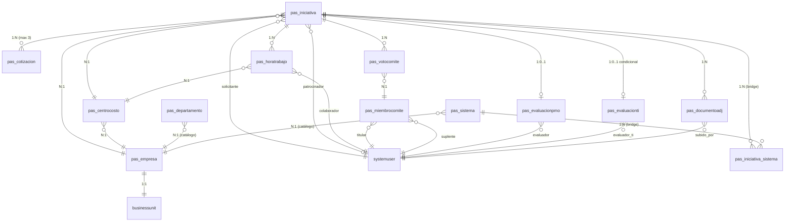

# Modelo de Datos — INNOVA

> **Versión**: 1.5 (alineación con requerimientos del cliente — EPIC #27 / issues #28, #29, #33, #34)
> **Estado**: Diseño completo para implementación. Iteraciones menores permitidas como 1.x antes de M2.
> **Decisores**: Tech Lead, Arquitecto
>
> **Historial de versiones**: 1.0 (Sprint 0 issue #12) → 1.1 (+ `pas_fecha_solicitud`) → 1.2 (+ `pas_departamento` issue #28) → 1.3 (+ `pas_sistema` + bridge `pas_iniciativa_sistema` issue #29) → 1.4 (reconciliación de labels `pas_iniciativa_estado` issue #33) → 1.5 (+ `pas_codigo_corto` en empresa + `pas_consecutivo_secuencia` en iniciativa para nuevo formato consecutivo COA-AAAA-NNN, issue #34)

## Resumen

INNOVA modela el ciclo completo de una iniciativa de proyecto en **15 tablas Dataverse** con prefijo `pas_`:

- **8 tablas de proceso** (creadas/editadas por usuarios funcionales durante el flujo, incluye bridge N:M `pas_iniciativa_sistema`)
- **7 tablas de configuración** (CRUD por Administrador via M11)

Más datos tenant-specific en **Environment Variables** (ver [`entrega-cliente.md`](entrega-cliente.md)).

Decisiones clave de este modelo:

- **Empresas modeladas como tabla** `pas_empresa` + lookup a Business Unit del sistema (decisión ADR-0003 ampliada)
- **Versionado por audit nativo de Dataverse** en v1.0; `pas_iniciativa_snapshot` se evaluará en v1.x si el negocio lo requiere
- **Currency requerido** en toda columna money; default `CRC` (colones), parametrizable
- **`pas_consecutivo`** generado por flow helper con lock (formato `<codigo-empresa>-<año>-<seq:000>`, ej. `COA-2026-001`). Algoritmo y validaciones en [`numeracion-consecutivos.md`](numeracion-consecutivos.md)

## Diagrama ER

## Clasificación por origen del dato

| Tabla | Origen | CRUD por | Carga inicial |
|---|---|---|---|
| `pas_iniciativa` | **Proceso** | Solicitante crea; PMO/TI/Jefatura/Gerencia/Comité actualizan según fase | Vacía |
| `pas_evaluacionpmo` | **Proceso** | PMO | Vacía |
| `pas_evaluacionti` | **Proceso** | TI | Vacía |
| `pas_cotizacion` | **Proceso** | PMO | Vacía |
| `pas_horatrabajo` | **Proceso** | PMO, TI durante levantamiento/estimación/ejecución | Vacía |
| `pas_votocomite` | **Proceso** | Miembros del Comité | Vacía |
| `pas_documentoadj` | **Proceso** | Cualquier usuario autenticado en su fase | Vacía |
| `pas_iniciativa_sistema` | **Proceso** (bridge N:M) | Solicitante crea al elegir sistemas en M2 | Vacía |
| `pas_empresa` | **Configuración** | M11 Administrador | Seed con 3 placeholders (`Empresa A/B/C`) |
| `pas_centrocosto` | **Configuración** | M11 Administrador | Seed con 3 placeholders (`CC-001/002/003`) |
| `pas_departamento` | **Configuración** | M11 Administrador | Seed con departamentos placeholder por empresa (issue #28) |
| `pas_sistema` | **Configuración** | M11 Administrador | Seed con sistemas placeholder por empresa (issue #29) |
| `pas_plantillacorreo` | **Configuración** | M11 Administrador | Seed con 5 plantillas genéricas |
| `pas_parametro` | **Configuración** | M11 Administrador | Seed con umbrales y tarifas placeholder |
| `pas_miembrocomite` | **Configuración** | M11 Administrador | Seed con 3 usuarios test |

**Datos tenant-specific** (no viven en Dataverse): URLs SharePoint, correos institucionales, IDs Teams. Modelados como Environment Variables — ver [`entrega-cliente.md`](entrega-cliente.md).

## Choice sets globales

Todos los choice sets son **globales** (no per-tabla) para poder reusarse.

### `pas_iniciativa_estado` (17 valores)

> Labels alineados con el cuadro resumen del cliente (issue #33, v1.4). Los `Value` numéricos se preservaron del Sprint 0 — solo los labels cambiaron porque DEV/QA no tienen datos aún.

| Valor | Etiqueta | Descripción |
|---|---|---|
| 100000000 | Borrador | Solicitante editando antes de enviar |
| 100000001 | Revisión inicial PMO | PMO recibió, está haciendo levantamiento |
| 100000002 | Estimación Desarrollo | TI está estimando esfuerzo de desarrollo |
| 100000003 | Revisión Estimación de la Jefatura | Esperando que jefatura revise la estimación TI |
| 100000004 | Estimación Aprobada por Jefatura | Jefatura aprobó la estimación, pasa a cotizaciones |
| 100000005 | Estimación Devuelta por Jefatura | Jefatura devolvió la estimación a TI para ajustes |
| 100000006 | Estimación Rechazada por Jefatura | Jefatura rechazó la estimación (cierre por costo/factibilidad) |
| 100000007 | Revisión Iniciativa Jefatura | Esperando que jefatura revise la iniciativa (sin desarrollo) |
| 100000008 | Iniciativa Devuelta por Jefatura | Jefatura devolvió la iniciativa al solicitante para correcciones |
| 100000009 | En Cotización | PMO recopila hasta 3 cotizaciones |
| 100000010 | Revisión Gerencia de Negocio | Bajo umbral, espera decisión de Gerencia |
| 100000011 | Aprobada por Gerencia General de Negocio | Gerencia aprobó (resultado intermedio, no requiere Comité) |
| 100000012 | Rechazada por Gerencia General de Negocio | Gerencia rechazó |
| 100000013 | Revisión Comité de Proyectos | Sobre umbral o multi-empresa, espera votos del Comité |
| 100000014 | Aprobada | Estado final positivo (resultado Comité o consolidado tras Gerencia) |
| 100000015 | Rechazo del Comité | Estado final negativo desde Comité |
| 100000016 | Cancelada | Cancelada por Solicitante o Admin |

### `pas_iniciativa_prioridad`
| Valor | Etiqueta |
|---|---|
| 1 | P1 — Crítica |
| 2 | P2 — Alta |
| 3 | P3 — Media |

### `pas_iniciativa_complejidad`
| Valor | Etiqueta |
|---|---|
| 1 | Baja |
| 2 | Media |
| 3 | Alta |
| 4 | Muy Alta |

### `pas_iniciativa_clasificacion`
| Valor | Etiqueta |
|---|---|
| 1 | Mejora de proceso |
| 2 | Nuevo proceso |
| 3 | Cumplimiento regulatorio |
| 4 | Tecnología / Sistemas |
| 5 | Infraestructura |
| 6 | Otro |

### `pas_cotizacion_tipo`
| Valor | Etiqueta |
|---|---|
| 1 | Interna |
| 2 | Externa |

### `pas_decision` (Aprobar / Devolver / Rechazar — usado por Jefatura y Gerencia)
| Valor | Etiqueta |
|---|---|
| 1 | Aprobar |
| 2 | Devolver |
| 3 | Rechazar |

### `pas_voto` (binario — usado por Comité)
| Valor | Etiqueta |
|---|---|
| 1 | Aprobar |
| 2 | Rechazar |

### `pas_hora_tipo`
| Valor | Etiqueta |
|---|---|
| 1 | Levantamiento PMO |
| 2 | Estimación TI |
| 3 | Ejecución |
| 4 | Otros |

### `pas_documento_tipo`
| Valor | Etiqueta |
|---|---|
| 1 | Cotización |
| 2 | Entregable |
| 3 | Soporte / Análisis |
| 4 | Otro |

### `pas_parametro_tipo`
| Valor | Etiqueta |
|---|---|
| 1 | Texto |
| 2 | Número |
| 3 | Fecha |
| 4 | Booleano |

### `pas_evaluacion_estado`
| Valor | Etiqueta |
|---|---|
| 1 | En Proceso |
| 2 | Completa |

---

## Tablas de proceso

### `pas_iniciativa` — Entidad central

**Display name**: Iniciativa
**Ownership**: User or Team (BU-scoped)
**Audit**: ON (full)

| Columna | Tipo | Required | Descripción |
|---|---|---|---|
| `pas_iniciativaid` | Uniqueidentifier (PK) | sí | Generado por Dataverse |
| `pas_consecutivo` | Text(20) | sí | Formato `<codigo_corto_empresa>-{año}-{seq:000}` (ej. `COA-2026-001`). Único. Generado por flow helper con `Concurrency Control=1`. Ver [`numeracion-consecutivos.md`](numeracion-consecutivos.md) |
| `pas_consecutivo_secuencia` | Integer | no | v1.5: secuencia numérica aislada (0-999999) usada para componer `pas_consecutivo`. Permite calcular el siguiente sin parsear el string |
| `pas_titulo` | Text(200) | sí | Título corto de la iniciativa |
| `pas_descripcion` | Text(2000) | sí | Descripción inicial del Solicitante |
| `pas_descripcion_ampliada` | Text(4000) | no | Descripción ampliada por PMO durante levantamiento |
| `pas_solicitante` | Lookup → systemuser | sí | Quien crea la iniciativa |
| `pas_patrocinador` | Lookup → systemuser | no | Ejecutivo que respalda |
| `pas_empresa` | Lookup → pas_empresa | sí | Empresa del Grupo Pasquí dueña de la iniciativa |
| `pas_centrocosto` | Lookup → pas_centrocosto | sí | Centro de costo principal |
| `pas_clasificacion` | Choice `pas_iniciativa_clasificacion` | no | Asignada por PMO en evaluación |
| `pas_complejidad` | Choice `pas_iniciativa_complejidad` | no | Asignada por PMO en evaluación |
| `pas_prioridad` | Choice `pas_iniciativa_prioridad` | no | Asignada por Jefatura al aprobar |
| `pas_requiere_desarrollo` | Boolean | no | Activado por PMO si va a TI |
| `pas_es_multi_empresa` | Boolean | no | True si involucra >1 BU (regla de escalamiento a Comité) |
| `pas_estado` | Choice `pas_iniciativa_estado` | sí | Estado del workflow (default: Borrador) |
| `pas_fecha_solicitud` | DateTime | no | Fecha y hora en que el Solicitante envía la iniciativa (transición de Borrador a Revisión inicial PMO). Distinto a `createdon` (que es el guardado inicial). Set por flow al cambiar estado |
| `pas_decision_jefatura` | Choice `pas_decision` | no | Aprobar / Devolver / Rechazar |
| `pas_decision_jefatura_comentario` | Text(2000) | no | Requerido si Devolver o Rechazar |
| `pas_fecha_decision_jefatura` | DateTime | no | Set por flow al registrar decisión |
| `pas_decision_gerencia` | Choice `pas_decision` | no | Aprobar / Rechazar (no Devolver en Gerencia) |
| `pas_decision_gerencia_comentario` | Text(2000) | no | Requerido si Rechazar |
| `pas_fecha_decision_gerencia` | DateTime | no | |
| `pas_resultado_comite` | Choice (Aprobada, Rechazada, En Voto) | no | Resultado consolidado por flow |
| `pas_fecha_cierre_comite` | DateTime | no | Cuando se consolidó voto |
| `pas_monto_estimado` | Money | no | Calculado: cotización ganadora o estimación TI |
| `pas_currency` | Lookup → transactioncurrency | sí | Default CRC |
| `pas_ahorro_anual_estimado` | Money | no | Beneficio anual proyectado |
| `pas_roi_porcentaje` | Decimal(2) | no | Calculado: (ahorro − costo) / costo × 100 |
| `pas_resumen_ejecucion` | Text(4000) | no | Capturado en pantalla #5 al cerrar ejecución |
| `pas_fecha_terminacion_ejecucion` | DateTime | no | Set al pasar a "Pendiente Validación Jefatura" |
| `pas_anio` | Integer | no | Año (2024-2100) usado por el algoritmo de consecutivo. Se llena por flow al enviar (Borrador → Revisión inicial PMO). Índice para reportes anuales |
| `pas_dias_pendiente` | Integer | no | Calculado: días desde último cambio de estado |
| (audit) | — | auto | createdon, createdby, modifiedon, modifiedby, owninguser, owningbusinessunit |

**Total**: 25 columnas custom + 7 audit/system.

### `pas_evaluacionpmo` — Evaluación PMO

**Display name**: Evaluación PMO
**Ownership**: User
**Audit**: ON

| Columna | Tipo | Required | Descripción |
|---|---|---|---|
| `pas_evaluacionpmoid` | Uniqueidentifier (PK) | sí | |
| `pas_iniciativa` | Lookup → pas_iniciativa | sí | 1:0..1 (alternate key para enforcement) |
| `pas_evaluador` | Lookup → systemuser | sí | Quien hace la evaluación |
| `pas_clasificacion_pmo` | Choice `pas_iniciativa_clasificacion` | sí | |
| `pas_complejidad_pmo` | Choice `pas_iniciativa_complejidad` | sí | |
| `pas_horas_levantamiento` | Decimal(2) | sí | |
| `pas_tarifa_aplicada` | Money | no | Snapshot de `TarifaHoraPMO` al momento (auditoría) |
| `pas_costo_levantamiento` | Money | no | Calculado: horas × tarifa |
| `pas_currency` | Lookup → transactioncurrency | sí | |
| `pas_requiere_desarrollo` | Boolean | sí | Determina si pasa a TI |
| `pas_descripcion_pmo` | Text(4000) | sí | Descripción ampliada del entendimiento |
| `pas_riesgos_pmo` | Text(2000) | no | |
| `pas_recomendacion` | Text(2000) | no | |
| `pas_estado` | Choice `pas_evaluacion_estado` | sí | En Proceso / Completa |
| `pas_fecha_completada` | DateTime | no | |

### `pas_evaluacionti` — Evaluación TI (condicional)

**Display name**: Evaluación TI
**Ownership**: User
**Audit**: ON
**Nota**: Solo se crea si `pas_iniciativa.pas_requiere_desarrollo = true`

| Columna | Tipo | Required | Descripción |
|---|---|---|---|
| `pas_evaluacionti id` | Uniqueidentifier (PK) | sí | |
| `pas_iniciativa` | Lookup → pas_iniciativa | sí | 1:0..1 |
| `pas_evaluador_ti` | Lookup → systemuser | sí | |
| `pas_horas_desarrollo` | Decimal(2) | sí | |
| `pas_horas_qa` | Decimal(2) | no | |
| `pas_horas_otros` | Decimal(2) | no | Análisis, despliegue, etc. |
| `pas_horas_total` | Decimal(2) | no | Calculado |
| `pas_tarifa_aplicada` | Money | no | Snapshot de `TarifaHoraTI` |
| `pas_costo_estimado` | Money | no | Calculado |
| `pas_currency` | Lookup → transactioncurrency | sí | |
| `pas_supuestos` | Text(4000) | sí | Supuestos críticos de la estimación |
| `pas_riesgos_tecnicos` | Text(2000) | no | |
| `pas_propuesta_tecnica` | Text(4000) | no | Arquitectura / approach |
| `pas_estado` | Choice `pas_evaluacion_estado` | sí | |
| `pas_fecha_completada` | DateTime | no | |

### `pas_cotizacion` — Cotizaciones (máx 3 por iniciativa)

**Display name**: Cotización
**Ownership**: User
**Audit**: ON

| Columna | Tipo | Required | Descripción |
|---|---|---|---|
| `pas_cotizacionid` | Uniqueidentifier (PK) | sí | |
| `pas_iniciativa` | Lookup → pas_iniciativa | sí | |
| `pas_tipo` | Choice `pas_cotizacion_tipo` | sí | Interna / Externa |
| `pas_proveedor` | Text(200) | sí | Nombre del proveedor o equipo interno |
| `pas_monto` | Money | sí | |
| `pas_currency` | Lookup → transactioncurrency | sí | |
| `pas_alcance` | Text(4000) | sí | Qué incluye |
| `pas_plazo_dias` | Integer | sí | Días para entregar |
| `pas_es_ganadora` | Boolean | no | Solo 1 true por iniciativa (regla en flow) |
| `pas_justificacion_ganadora` | Text(2000) | no | Requerido si `pas_es_ganadora = true` |
| `pas_fecha_cotizacion` | Date | sí | Fecha de la propuesta |
| `pas_contacto_proveedor` | Text(200) | no | |
| `pas_correo_contacto` | Text(100) | no | |

### `pas_horatrabajo` — Bitácora de horas

**Display name**: Hora de Trabajo
**Ownership**: User
**Audit**: ON (limitado, alto volumen)

| Columna | Tipo | Required | Descripción |
|---|---|---|---|
| `pas_horatrabajoid` | Uniqueidentifier (PK) | sí | |
| `pas_iniciativa` | Lookup → pas_iniciativa | sí | |
| `pas_colaborador` | Lookup → systemuser | sí | Quien registra las horas |
| `pas_centrocosto` | Lookup → pas_centrocosto | sí | Para reportería financiera |
| `pas_tipo` | Choice `pas_hora_tipo` | sí | Levantamiento / Estimación / Ejecución / Otros |
| `pas_horas` | Decimal(2) | sí | |
| `pas_fecha_trabajo` | Date | sí | Cuándo se trabajaron las horas |
| `pas_descripcion` | Text(2000) | no | Detalle del trabajo |
| `pas_tarifa_aplicada` | Money | no | Snapshot de tarifa al momento |
| `pas_costo_calculado` | Money | no | Calculado |
| `pas_currency` | Lookup → transactioncurrency | sí | |

### `pas_votocomite` — Votos del Comité

**Display name**: Voto del Comité
**Ownership**: User
**Audit**: ON
**Alternate key**: composite (`pas_iniciativa` + `pas_miembro`) único

| Columna | Tipo | Required | Descripción |
|---|---|---|---|
| `pas_votocomiteid` | Uniqueidentifier (PK) | sí | |
| `pas_iniciativa` | Lookup → pas_iniciativa | sí | |
| `pas_miembro` | Lookup → pas_miembrocomite | sí | |
| `pas_voto` | Choice `pas_voto` | sí | Aprobar / Rechazar (binario) |
| `pas_comentario` | Text(2000) | sí | Justificación del voto (obligatoria) |
| `pas_fecha_voto` | DateTime | sí | Set por flow al guardar |
| `pas_es_suplente` | Boolean | no | True si votó el suplente del titular |

### `pas_documentoadj` — Metadata de adjuntos

**Display name**: Documento Adjunto
**Ownership**: User
**Audit**: OFF (los archivos están en SharePoint)
**Nota**: Esta tabla guarda **metadata**; el archivo binario vive en SharePoint

| Columna | Tipo | Required | Descripción |
|---|---|---|---|
| `pas_documentoadjid` | Uniqueidentifier (PK) | sí | |
| `pas_iniciativa` | Lookup → pas_iniciativa | sí | |
| `pas_nombre_archivo` | Text(200) | sí | |
| `pas_url_sharepoint` | Text(500) | sí | Link al archivo en SharePoint |
| `pas_tipo_documento` | Choice `pas_documento_tipo` | sí | |
| `pas_subido_por` | Lookup → systemuser | sí | |
| `pas_tamano_bytes` | BigInt | no | |
| `pas_extension` | Text(10) | no | pdf, xlsx, docx, etc. |
| `pas_descripcion` | Text(1000) | no | |

---

## Tablas de configuración (administradas vía M11)

### `pas_empresa` — Empresas del Grupo Pasquí

**Display name**: Empresa
**Ownership**: Organization
**Audit**: ON

| Columna | Tipo | Required | Descripción |
|---|---|---|---|
| `pas_empresaid` | Uniqueidentifier (PK) | sí | |
| `pas_nombre` | Text(200) | sí | Razón social completa |
| `pas_nombre_corto` | Text(50) | sí | Abreviatura para UI (display, ej. "Pasquí Industrial" → "Pasquí Ind.") |
| `pas_codigo_corto` | Text(3) | sí | v1.5: prefijo de 3 letras ASCII MAYÚSCULAS para consecutivo de iniciativas (ej. "COA"). Validado en UI/flow `^[A-Z]{3}$`. Único. Ver [`numeracion-consecutivos.md`](numeracion-consecutivos.md) |
| `pas_codigo_contable` | Text(20) | no | Para integración con ERP |
| `pas_business_unit` | Lookup → businessunit | sí | BU del sistema que segmenta los datos. **No editable después de creación** (cambiar BU = workflow especial admin) |
| `pas_logo` | Image | no | Logo para reportes |
| `pas_contacto_principal` | Lookup → systemuser | no | Contacto operativo principal |
| `pas_correo_corporativo` | Text(100) | no | Para notificaciones corporativas |
| `pas_activa` | Boolean | sí | Permite desactivar sin borrar (default: true) |
| `pas_orden_display` | Integer | no | Para ordenamiento en dropdowns |

### `pas_centrocosto` — Centros de costo

**Display name**: Centro de Costo
**Ownership**: Organization
**Audit**: ON

| Columna | Tipo | Required | Descripción |
|---|---|---|---|
| `pas_centrocostoid` | Uniqueidentifier (PK) | sí | |
| `pas_codigo` | Text(20) | sí | Único. Formato libre, sugerido `CC-XXX` |
| `pas_nombre` | Text(200) | sí | Descripción |
| `pas_empresa` | Lookup → pas_empresa | sí | Empresa dueña |
| `pas_responsable` | Lookup → systemuser | no | Para reportería |
| `pas_activo` | Boolean | sí | Soft delete (default: true) |

### `pas_departamento` — Departamentos por empresa

> Agregada en v1.2 (issue #28 / G1 — alineación con requerimiento del cliente: "Departamento: lista desplegable parametrizable acorde a la empresa elegida").

**Display name**: Departamento
**Ownership**: Organization
**Audit**: ON

| Columna | Tipo | Required | Descripción |
|---|---|---|---|
| `pas_departamentoid` | Uniqueidentifier (PK) | sí | |
| `pas_nombre` | Text(100) | sí | **Primary**. Nombre del departamento |
| `pas_codigo` | Text(20) | no | Código opcional para integraciones externas |
| `pas_descripcion` | Memo(1000) | no | |
| `pas_empresa` | Lookup → pas_empresa | sí | Empresa dueña. La UI filtra el dropdown por la empresa elegida |
| `pas_activo` | Boolean | sí | Soft delete (default: true) |

**Uso esperado**: la pantalla "Nueva Solicitud" (M2) muestra un dropdown "Departamento" cuyo `Items` es:
`Filter(pas_departamentos, pas_empresa.pas_empresaid = SelectedEmpresa.pas_empresaid && pas_activo = true)`

Una iniciativa puede tener (futuro v1.3) un lookup a `pas_departamento` — se evalúa en issue #31 (G4).

### `pas_sistema` — Catálogo de sistemas integrables por empresa

> Agregada en v1.3 (issue #29 / G2 — alineación con requerimiento del cliente: "Sistemas a integrar: lista desplegable parametrizable, catálogo por compañía, selección múltiple").

**Display name**: Sistema
**Ownership**: Organization
**Audit**: ON

| Columna | Tipo | Required | Descripción |
|---|---|---|---|
| `pas_sistemaid` | Uniqueidentifier (PK) | sí | |
| `pas_nombre` | Text(100) | sí | **Primary**. Nombre del sistema (ej. "SAP", "Salesforce") |
| `pas_codigo` | Text(20) | no | Código opcional para integraciones externas |
| `pas_descripcion` | Memo(1000) | no | |
| `pas_empresa` | Lookup → pas_empresa | sí | Empresa dueña |
| `pas_activo` | Boolean | sí | Soft delete (default: true) |

### `pas_iniciativa_sistema` — Tabla puente N:M iniciativa ↔ sistema

> Agregada en v1.3 (issue #29 / G2). Permite que una iniciativa con `pas_requiere_integracion = true` declare N sistemas afectados.

**Display name**: Sistema de Iniciativa
**Ownership**: User
**Audit**: ON

| Columna | Tipo | Required | Descripción |
|---|---|---|---|
| `pas_iniciativa_sistemaid` | Uniqueidentifier (PK) | sí | |
| `pas_nombre` | Text(200) | sí | **Primary**. Display compuesto `{consecutivo iniciativa} - {nombre sistema}`. Llenado por flow al crear el registro |
| `pas_iniciativa` | Lookup → pas_iniciativa | sí | Cascade Delete: si la iniciativa se elimina, sus filas bridge también |
| `pas_sistema` | Lookup → pas_sistema | sí | Restrict Delete: protege referencias históricas; admin debe desactivar (`pas_activo=false`) en lugar de borrar |

**Patrón de uso**:
1. En M2 (Nueva Solicitud), si Solicitante marca `pas_requiere_integracion = true`, aparece un Multi-select de sistemas filtrado por empresa
2. Por cada sistema elegido, se hace `Patch(pas_iniciativa_sistemas, Defaults(...), {pas_iniciativa: <ref>, pas_sistema: <ref>})`
3. Para listar sistemas de una iniciativa: `Filter(pas_iniciativa_sistemas, pas_iniciativa.pas_iniciativaid = <id>)`

**Por qué bridge custom y no N:M nativo de Dataverse**: las N:M nativas (`Microsoft.Dynamics.CRM.ManyToManyRelationshipMetadata`) no permiten columnas custom, ni audit trail diferenciado, ni flows que se disparen al asociar. La tabla puente custom da más control para reportería y notificaciones futuras (ej. "se eliminó esta integración el día X por usuario Y").

### `pas_plantillacorreo` — Plantillas de correo

**Display name**: Plantilla de Correo
**Ownership**: Organization
**Audit**: ON

| Columna | Tipo | Required | Descripción |
|---|---|---|---|
| `pas_plantillacorreoid` | Uniqueidentifier (PK) | sí | |
| `pas_nombre_clave` | Text(100) | sí | Único. Usado por flows para identificar plantilla (ej: `iniciativa_creada_pmo`) |
| `pas_nombre_display` | Text(200) | sí | Nombre amigable para Admin |
| `pas_asunto` | Text(200) | sí | Soporta variables `{nombreVariable}` |
| `pas_cuerpo_html` | Text(8000) | sí | HTML del correo, soporta variables |
| `pas_descripcion` | Text(1000) | no | Cuándo se usa esta plantilla |
| `pas_variables_documentadas` | Text(2000) | no | Lista de variables válidas (ej: `{consecutivo}`, `{solicitante}`) |
| `pas_activa` | Boolean | sí | Si false, el flow usa fallback (default: true) |

### `pas_parametro` — Parámetros del sistema

**Display name**: Parámetro
**Ownership**: Organization
**Audit**: ON (todos los cambios trazables)

| Columna | Tipo | Required | Descripción |
|---|---|---|---|
| `pas_parametroid` | Uniqueidentifier (PK) | sí | |
| `pas_clave` | Text(100) | sí | Único. Identificador estable usado por flows (ej: `UmbralEscalamientoComite`) |
| `pas_nombre_display` | Text(200) | sí | Nombre amigable |
| `pas_tipo` | Choice `pas_parametro_tipo` | sí | Texto / Número / Fecha / Booleano |
| `pas_valor_texto` | Text(2000) | no | Si tipo = Texto |
| `pas_valor_numero` | Decimal(4) | no | Si tipo = Número |
| `pas_valor_fecha` | Date | no | Si tipo = Fecha |
| `pas_valor_booleano` | Boolean | no | Si tipo = Booleano |
| `pas_descripcion` | Text(1000) | sí | Para qué sirve el parámetro |
| `pas_unidad` | Text(20) | no | Ej: `CRC`, `días`, `horas`, `%` |

### `pas_miembrocomite` — Miembros del Comité de Proyectos

**Display name**: Miembro del Comité
**Ownership**: Organization
**Audit**: ON

| Columna | Tipo | Required | Descripción |
|---|---|---|---|
| `pas_miembrocomiteid` | Uniqueidentifier (PK) | sí | |
| `pas_titular` | Lookup → systemuser | sí | Miembro principal |
| `pas_suplente` | Lookup → systemuser | sí | Suplente (obligatorio para activar miembro) |
| `pas_cargo` | Text(200) | no | Cargo institucional |
| `pas_fecha_inicio_vigencia` | Date | sí | |
| `pas_fecha_fin_vigencia` | Date | no | Si null, vigencia indefinida |
| `pas_activo` | Boolean | sí | Default: true |
| `pas_dias_max_voto` | Integer | sí | Default: 7. Después se habilita suplente |

---

## Reglas de negocio (Business Rules)

Estas reglas se implementan en Power Fx (Canvas), Power Automate (flows) y/o Business Rules de Dataverse. La implementación específica se decide por regla en el respectivo módulo.

| # | Regla | Implementación sugerida |
|---|---|---|
| BR-1 | `pas_consecutivo` único, formato `<codigo_corto>-{año}-{seq:000}` por empresa+año (ej. `COA-2026-001`) | Flow `INNOVA - Helper - Generar Consecutivo` con `Concurrency Control=1`. Ver [`numeracion-consecutivos.md`](numeracion-consecutivos.md) |
| BR-2 | Máximo 3 cotizaciones por iniciativa | Validación UI en Canvas + business rule Dataverse |
| BR-3 | Solo 1 cotización ganadora por iniciativa | Flow trigger en `pas_cotizacion` Update; opcional plugin C# |
| BR-4 | Cotización ganadora requiere `pas_justificacion_ganadora` | Business Rule Dataverse |
| BR-5 | Decisión `Devolver` o `Rechazar` requiere comentario | Business Rule Dataverse |
| BR-6 | Voto del Comité requiere `pas_comentario` | Required column en tabla |
| BR-7 | Un miembro vota solo una vez por iniciativa | Alternate key (`pas_iniciativa` + `pas_miembro`) |
| BR-8 | Solo se activa suplente si titular no votó en `pas_dias_max_voto` | Flow programado diario |
| BR-9 | `pas_evaluacionti` solo se crea si `pas_iniciativa.pas_requiere_desarrollo = true` | Flow trigger + validación |
| BR-10 | Ejecución solo se cierra si hay al menos 1 avance + 1 entregable | Validación en pantalla Canvas (M6) |
| BR-11 | Currency obligatorio en toda columna Money | Estándar Dataverse (forzado por plataforma) |
| BR-12 | `pas_empresa.pas_business_unit` no editable después de creación | Plugin C# o columna Read-Only en form |
| BR-13 | `pas_es_multi_empresa = true` fuerza escalamiento a Comité | Flow de routing en M7 |
| BR-14 | `pas_monto_estimado > pas_parametro.UmbralEscalamientoComite` fuerza escalamiento | Flow de routing en M7 |
| BR-15 | No eliminar `pas_centrocosto` ni `pas_empresa` si tienen registros asociados | Plugin C# o validación pre-delete |
| BR-16 | Snapshot de tarifa al crear `pas_horatrabajo` | Flow con lookup a `pas_parametro` al Create |
| BR-17 | Solicitante solo puede editar `pas_iniciativa` mientras `pas_estado = Borrador` | Security role + business rule |

---

## Relaciones detalladas

| Origen | Destino | Tipo | On delete | Notas |
|---|---|---|---|---|
| `pas_iniciativa` | `pas_empresa` | N:1 | Restrict | No borrar empresa con iniciativas |
| `pas_iniciativa` | `pas_centrocosto` | N:1 | Restrict | No borrar CC con iniciativas |
| `pas_iniciativa` | `systemuser` (solicitante) | N:1 | Restrict | No borrar usuario con iniciativas |
| `pas_iniciativa` | `systemuser` (patrocinador) | N:1 | Remove link | Opcional |
| `pas_evaluacionpmo` | `pas_iniciativa` | N:1 (1:0..1 lógico) | Cascade | Alternate key en `pas_iniciativa` |
| `pas_evaluacionti` | `pas_iniciativa` | N:1 (1:0..1 lógico) | Cascade | Alternate key en `pas_iniciativa` |
| `pas_cotizacion` | `pas_iniciativa` | N:1 | Cascade | |
| `pas_horatrabajo` | `pas_iniciativa` | N:1 | Cascade | |
| `pas_horatrabajo` | `pas_centrocosto` | N:1 | Restrict | |
| `pas_votocomite` | `pas_iniciativa` | N:1 | Cascade | |
| `pas_votocomite` | `pas_miembrocomite` | N:1 | Restrict | |
| `pas_documentoadj` | `pas_iniciativa` | N:1 | Cascade | Archivos en SharePoint se conservan (responsabilidad cliente) |
| `pas_empresa` | `businessunit` | 1:1 | Restrict | BU del sistema, manejada via Admin Center |
| `pas_centrocosto` | `pas_empresa` | N:1 | Restrict | |
| `pas_departamento` | `pas_empresa` | N:1 | Restrict | v1.2: catálogo de departamentos filtrado por empresa |
| `pas_sistema` | `pas_empresa` | N:1 | Restrict | v1.3: catálogo de sistemas filtrado por empresa |
| `pas_iniciativa_sistema` | `pas_iniciativa` | N:1 | Cascade | v1.3: bridge N:M; al borrar iniciativa se limpian sus filas bridge |
| `pas_iniciativa_sistema` | `pas_sistema` | N:1 | Restrict | v1.3: bridge N:M; protege catálogo (admin debe desactivar sistema en lugar de borrar) |
| `pas_miembrocomite` | `systemuser` (titular) | N:1 | Restrict | |
| `pas_miembrocomite` | `systemuser` (suplente) | N:1 | Restrict | |

---

## Decisiones del modelo y rationale

### Por qué `pas_empresa` como tabla en lugar de solo BU

- Permite metadata adicional por empresa (logo para reportes, código contable para ERP, contacto principal, correo corporativo)
- Permite gestión via M11 (Admin amigable) además del Power Platform Admin Center (técnico)
- Facilita reportería: joins más naturales que con `businessunit`
- El lookup `pas_business_unit` mantiene el aislamiento de datos según ADR-0003

**Trade-off**: una tabla más que mantener y mantener sincronizada con las BUs. Mitigación: BR-12 prohíbe cambios destructivos.

### Por qué no `pas_iniciativa_snapshot` en v1.0

- Dataverse audit nativo cubre auditoría a nivel de campo
- Snapshot agrega storage 5-10x según frecuencia
- Solo se necesita si negocio pide "reconstruir lo que vio aprobador X en fecha Y" como objeto entero
- Decisión: empezar sin snapshot, evaluar en v1.x si el negocio lo pide

### Por qué `pas_parametro` con valor multi-tipo (texto/número/fecha/booleano)

- Single source of truth para configuración
- Simplifica M11-H1 (una sola pantalla CRUD)
- Flows hacen `IfError(Decimal(parametro.pas_valor_numero), 0)` según tipo
- Alternativa rechazada: una tabla por tipo de parámetro (sobre-modelado)

### Por qué snapshot de tarifa en `pas_horatrabajo.pas_tarifa_aplicada`

- Si la tarifa cambia, las horas históricas no se recalculan
- Auditoría clara: "cuando se registró, la tarifa era X"
- BR-16 lo enforza al Create

### Por qué `pas_documentoadj` sin audit

- Alto volumen esperado (varios adjuntos por iniciativa × cientos de iniciativas)
- Audit consume storage rápidamente
- El "qué cambió" es delegado a SharePoint (versioning nativo)

### Por qué Choice global y no per-table

- Reutilizable entre tablas (ej: `pas_evaluacion_estado` en evaluacionpmo y evaluacionti)
- Centraliza ajustes de etiquetas (cambiar etiqueta en un solo lugar)
- Trade-off: si un Choice se usa solo una vez, agrega complejidad innecesaria — pero en INNOVA todos los Choice tienen reuso real

---

## Cobertura por pantalla

Validación de que el modelo soporta todas las pantallas del análisis funcional:

| Pantalla | Tablas tocadas | Operación principal |
|---|---|---|
| #1 Solicitante | `pas_iniciativa`, `pas_documentoadj`, `pas_centrocosto` (lookup), `pas_empresa` (lookup) | Create iniciativa + upload docs |
| #2 PMO Evaluación | `pas_iniciativa` (update), `pas_evaluacionpmo` (create/update), `pas_horatrabajo` (create) | Evaluar y rutear |
| #3 TI Estimación | `pas_iniciativa` (update), `pas_evaluacionti` (create/update), `pas_horatrabajo` (create) | Estimar |
| #4 Jefatura Estimación | `pas_iniciativa` (update decisión + prioridad) | Decidir |
| #5 PMO Ejecución | `pas_iniciativa` (update), `pas_horatrabajo` (create N), `pas_documentoadj` (create N) | Documentar avances |
| #6 Jefatura Validación | `pas_iniciativa` (update) | Validar y escalar |
| #7 PMO Cotizaciones | `pas_cotizacion` (create N max 3), `pas_documentoadj` (create) | Cotizar y elegir ganadora |
| #8 Gerencia General | `pas_iniciativa` (update decisión + estado final) | Decidir |
| Comité | `pas_votocomite` (create N), `pas_iniciativa` (update via flow) | Votar |
| Administrador (M11) | `pas_parametro`, `pas_centrocosto`, `pas_departamento`, `pas_sistema`, `pas_plantillacorreo`, `pas_miembrocomite`, `pas_empresa` (CRUD) | Gestionar catálogos |
| Tracking "Mis Solicitudes" (M12) | `pas_iniciativa` (read filtrada) | Consultar |
| Reportería (M13) | Todas (DirectQuery) | Visualizar |

**No quedan operaciones del análisis sin cobertura de tabla.**

---

## Próximos pasos (post-merge de este modelo)

1. **S0-4 (#15)**: Crear las 12 tablas en DEV siguiendo este modelo
2. **S0-3 (#14)**: Definir matriz de Security Roles por tabla según este modelo
3. **S0-10 (#21)**: Implementar `seed-data.ps1` poblando las 5 tablas de configuración con placeholders documentados

## Historial

| Versión | Fecha | Cambios |
|---|---|---|
| 0.1 | 2026-05-23 | Placeholder inicial (11 tablas previstas) |
| **1.0** | 2026-05-24 | Modelo completo: 12 tablas (agregada `pas_empresa`), 11 choice sets, 17 business rules, ER diagram, clasificación por origen, decisiones documentadas. Issue #12 |
| **1.1** | 2026-05-24 | Agregada columna `pas_fecha_solicitud` a `pas_iniciativa` (issue #15) |
| **1.2** | 2026-05-24 | Agregada tabla `pas_departamento` (catálogo por empresa). EPIC #27 / issue #28 — alineación con requerimiento del cliente G1 |
| **1.3** | 2026-05-24 | Agregada tabla `pas_sistema` (catálogo por empresa) + bridge N:M `pas_iniciativa_sistema`. EPIC #27 / issue #29 — alineación con requerimiento del cliente G2 |
| **1.4** | 2026-05-24 | Sincronizados los 17 labels de `pas_iniciativa_estado` con los nombres exactos del cuadro resumen del cliente. EPIC #27 / issue #33 — G6 |
| **1.5** | 2026-05-24 | Agregada columna `pas_codigo_corto` a `pas_empresa` (3 letras ASCII upper) + `pas_consecutivo_secuencia` a `pas_iniciativa` (Integer). Nuevo formato consecutivo `<codigo>-{año}-{seq:000}` (ej. `COA-2026-001`). Algoritmo documentado en `docs/architecture/numeracion-consecutivos.md`. EPIC #27 / issue #34 — G7 |
